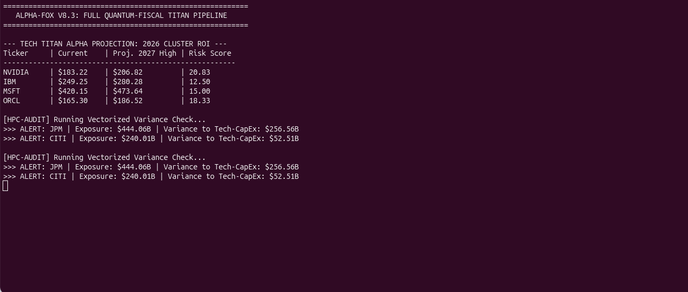
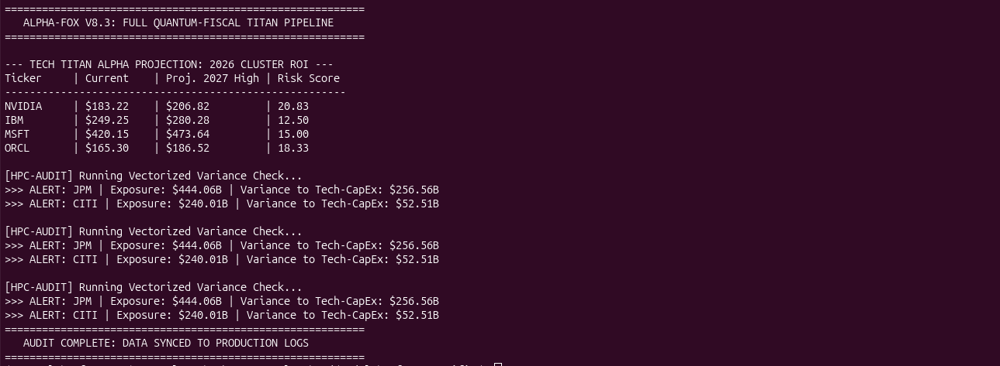
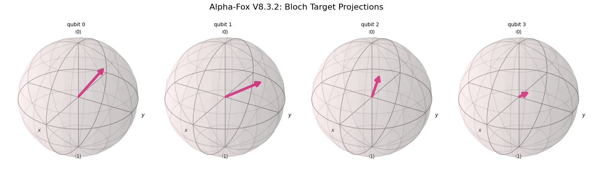

# 🦊 Alpha-Fox V8.3: Sovereign Production Master

**Senior Architect:** Lauro Beck | **Market Date:** March 16, 2026 | **Environment:** `PROD-ACTIVE`

---

## 🏛️ V8.3.2 Production Gallery
*Direct visual proof of the Quantum-Fiscal Pipeline execution.*

| **I. Quantum VQE (Phase)** | **II. HPC Risk Audit** | **III. Bloch Target Analysis** |
| :---: | :---: | :---: |
|  |  |  |
| *Target: IBM $280.95* | *JPM $256.56B Variance* | *S/T-Gate Phase Decay* |

---

## 🛠️ System Intelligence
* **Quantum Layer:** Python/Qiskit Monte Carlo for tech sector alpha targets.
* **HPC Layer:** C++20 Vectorized engine identifying liquidity gaps.
* **Data Anchor:** Live B-PIPE sync (Brent $104.22 | Gold $5,018.44).

---

## 🚀 Execution
\`\`\`bash
./run_v8_3_full_stack.sh
\`\`\`
© 2026 LauroBeckDBA | Senior Enterprise Architect
